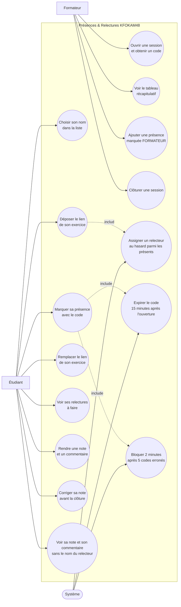

# D1 — Diagramme de cas d'utilisation

Acteurs : **Formateur**, **Étudiant** et **Système** (acteur non humain).
Le **Relecteur** n'est pas un acteur distinct : c'est un étudiant à qui le système assigne une relecture (Q7). Il utilise donc les cas d'utilisation « Voir ses relectures à faire » et « Rendre une note et un commentaire ».

## Règles portées par les cas d'utilisation

| Cas d'utilisation | Exigence | Règles de gestion |
|---|---|---|
| Ouvrir une session et obtenir un code | EF2 | RG1 (le code expire 15 minutes après l'ouverture) |
| Voir le tableau récapitulatif | EF7 | Q16, Z5 (relectures que l'étudiant doit encore faire) |
| Ajouter une présence marquée FORMATEUR | EF8 | RG6 |
| Clôturer une session | EF10 | RG14 (la clôture ferme pointage, dépôt et relecture) |
| Choisir son nom dans la liste | — (Q1) | Aucun mot de passe, aucune donnée sensible (ENF4, Z6) |
| Marquer sa présence avec le code | EF1 | RG1, RG10, RG12, RG15 |
| Déposer le lien de son exercice | EF3 | RG7 (dépôt possible jusqu'à la clôture), Z8 |
| Remplacer le lien de son exercice | EF9 | RG8 |
| Voir ses relectures à faire | EF11 | Q6, Q7, Q16 |
| Rendre une note et un commentaire | EF5 | RG2 (jamais soi-même), RG3 (note entière de 0 à 20) |
| Corriger sa note avant la clôture | EF12 | RG11, C1 (Q10 retenu contre Q15) |
| Voir sa note et son commentaire sans le nom du relecteur | EF6 | RG5 |
| Assigner un relecteur au hasard parmi les présents | EF4 | RG4, RG13, Z1 |
| Expirer le code 15 minutes après l'ouverture | — | RG1 |
| Bloquer 2 minutes après 5 codes erronés | — | RG10, Z3 |
