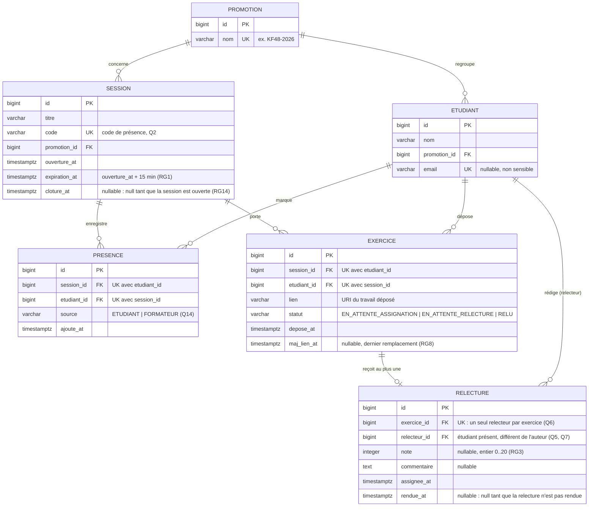

# D2 — Modèle de données

Ce modèle est celui des migrations Flyway `V1__schema_initial.sql` et suivantes : chaque entité ci-dessous correspond à une table, chaque attribut à une colonne, avec le même nom en `snake_case`.

## Contraintes portées par la base, et où elles se voient dans le diagramme

| Contrainte | Colonnes | Règle |
|---|---|---|
| Un étudiant ne pointe qu'une fois par session | `UNIQUE (session_id, etudiant_id)` sur `PRESENCE` | RG15, `409 DEJA_PRESENT` |
| Un étudiant ne dépose qu'un exercice par session | `UNIQUE (session_id, etudiant_id)` sur `EXERCICE` | contrat, `409 EXERCICE_DEJA_DEPOSE`, Z8 |
| Un exercice n'a qu'un seul relecteur | `UNIQUE (exercice_id)` sur `RELECTURE`, cardinalité `EXERCICE ||--o| RELECTURE` | Q6, RG4 |
| Jamais d'auto-relecture | `CHECK (relecteur_id <> auteur de l'exercice)`, vérifié en service | Q5, RG2 |
| Une note est un entier de 0 à 20 | `CHECK (note BETWEEN 0 AND 20)` sur `RELECTURE` | Q9, RG3, `400 NOTE_INVALIDE` |
| Le code d'une session est unique et retrouvable | `UNIQUE (code)` sur `SESSION` | Q2 |
| Aucun mot de passe stocké | aucune colonne de mot de passe | Q1, ENF4 |

## Cycle de vie du statut d'un exercice

`EN_ATTENTE_ASSIGNATION` : déposé, mais aucun relecteur candidat disponible (Z1, RG13).
`EN_ATTENTE_RELECTURE` : un relecteur est assigné, il n'a pas encore rendu (RG9, Q11).
`RELU` : la relecture est rendue, la note est corrigeable jusqu'à la clôture de la session (RG11, C1).
