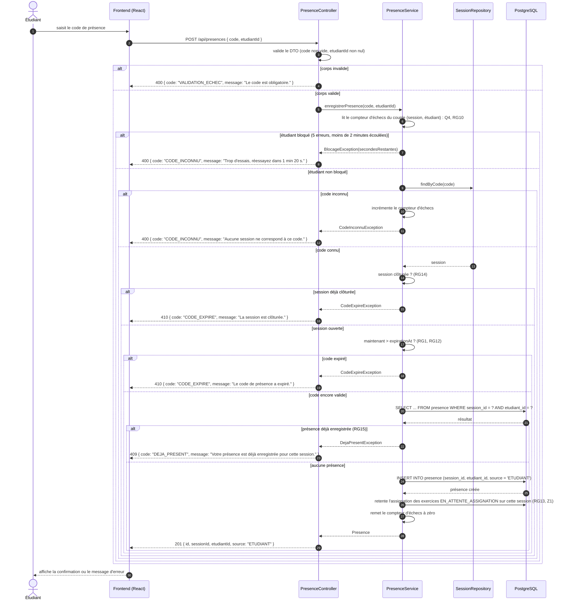

# D3 — Séquence : « marquer sa présence »

Cas nominal et cas d'erreur. Les codes HTTP et les corps de réponse sont ceux du contrat `api/contrat.yaml`.

## Correspondance avec le contrat

| Branche | Code HTTP | Corps d'erreur | Règle |
|---|---|---|---|
| Corps de requête invalide | `400` | `{ code: "VALIDATION_ECHEC", message }` | B4 |
| Étudiant bloqué | `400` | `{ code: "CODE_INCONNU", message }` | Q4, RG10, Z3 |
| Code inconnu | `400` | `{ code: "CODE_INCONNU", message }` | contrat |
| Session clôturée | `410` | `{ code: "CODE_EXPIRE", message }` | RG14 |
| Code expiré | `410` | `{ code: "CODE_EXPIRE", message }` | RG1, RG12 |
| Présence déjà enregistrée | `409` | `{ code: "DEJA_PRESENT", message }` | RG15 |
| Cas nominal | `201` | `{ id, sessionId, etudiantId, source }` | EF1 |

Deux choix explicites :

- Pendant un blocage, la réponse reste `CODE_INCONNU`, même si le code saisi était valide. C'est le but de Q4 : ne pas laisser deviner les codes. Le contrat ne prévoyant pas d'autre code d'erreur pour cette opération, je n'en invente pas et je mets l'information utile dans le `message`.
- L'insertion de la présence déclenche une nouvelle tentative d'assignation des exercices restés en attente d'assignation (Z1, RG13), ce qui évite qu'un exercice reste orphelin après l'arrivée d'un nouvel étudiant présent.
