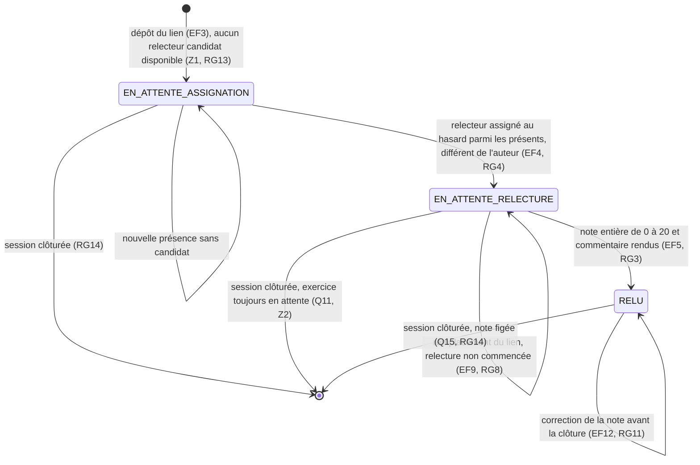

# D4 — États-transitions : cycle de vie d'un exercice

Diagramme bonus (+3). Il décrit les trois statuts du champ `statut` de l'entité `EXERCICE` (voir D2).

## Lecture

| État | Ce qu'il signifie | Visible où |
|---|---|---|
| `EN_ATTENTE_ASSIGNATION` | L'exercice est déposé, mais aucun étudiant présent autre que l'auteur n'est disponible pour le relire (trou du sujet, Z1). Le système retente l'assignation à chaque nouvelle présence (RG13). | Tableau du formateur, statut « non assigné » |
| `EN_ATTENTE_RELECTURE` | Un relecteur est assigné et n'a pas encore rendu. S'il ne rend jamais, l'exercice reste dans cet état (Q11, RG9). | Tableau du formateur et écran « mes relectures à faire » du relecteur |
| `RELU` | La note et le commentaire existent. La note est corrigeable par le relecteur jusqu'à la clôture de la session (Q10, RG11, C1). | Écran de l'étudiant relu (sans le nom du relecteur, Q8, RG5) |

## Transitions interdites, et pourquoi

| Transition refusée | Code HTTP | Règle |
|---|---|---|
| `EN_ATTENTE_RELECTURE` vers `RELU` par l'auteur de l'exercice | `403 AUTO_RELECTURE` | Q5, RG2 |
| `RELU` vers `RELU` après la clôture de la session | `409 RELECTURE_DEJA_RENDUE` | RG14, C1 |
| `EN_ATTENTE_*` vers `RELU` après la clôture de la session | `409 RELECTURE_DEJA_RENDUE` | Z2, RG14 |
| Remplacement du lien après que la relecture a commencé | `409 RELECTURE_COMMENCEE` | Q13, RG8 |
| Dépôt d'un exercice pendant une session clôturée | `400 DONNEE_INVALIDE` | Q12, RG14 |
